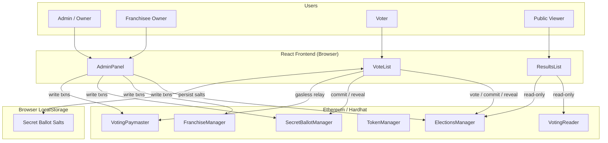
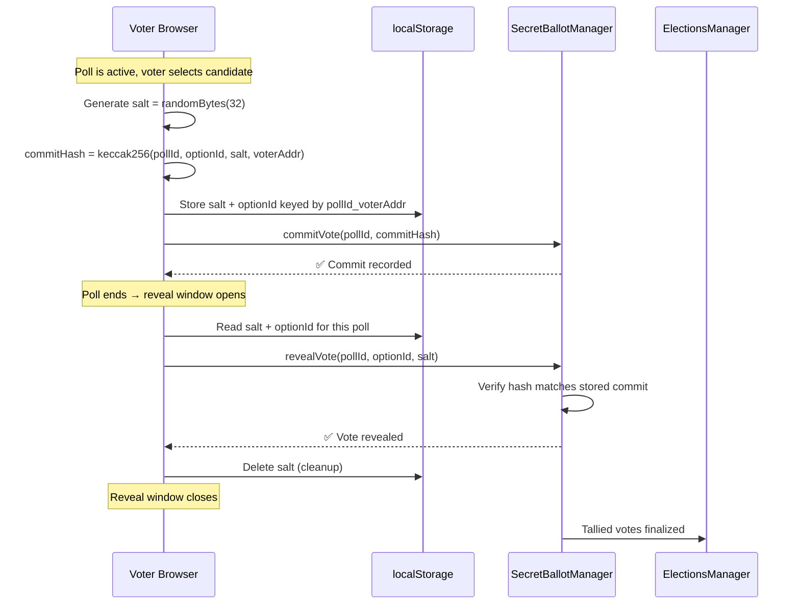
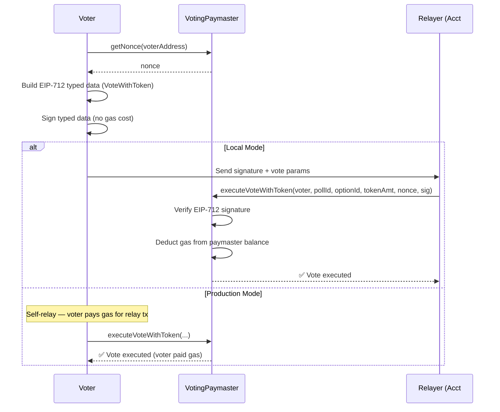
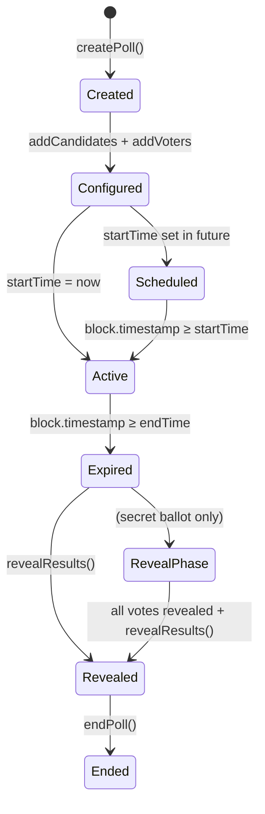
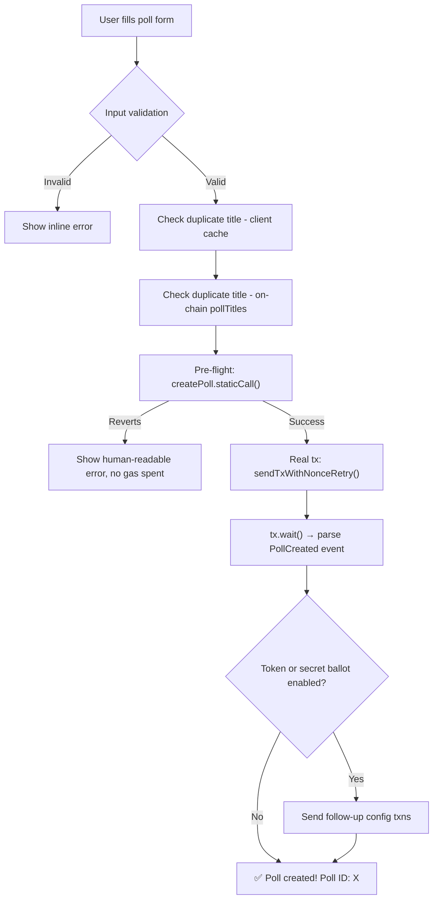
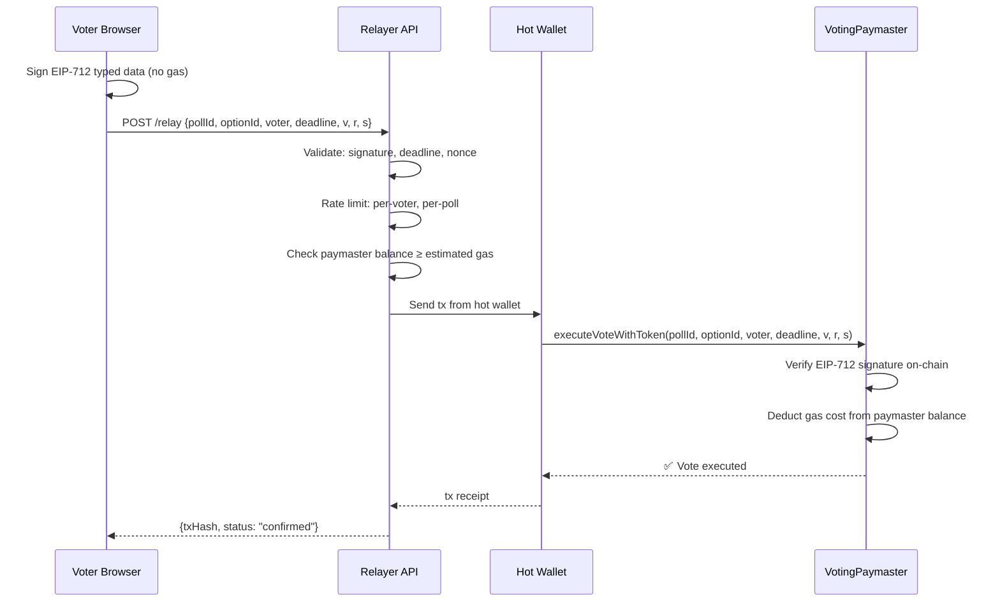

# Stunning Disco — Architecture & Design Document

> Copyright © 2026 Ankit Soral. All rights reserved. Proprietary and confidential.
> Unauthorized use, reproduction, or distribution is prohibited.

**Status:** Frontend and smart contract integration complete. Professional security audit pending.\
**Contact:** ankit.soral@outlook.com

---

## Table of Contents

1. [System Overview](#system-overview)
2. [Architecture Diagrams](#architecture-diagrams)
3. [Frontend Trust Model](#frontend-trust-model)
4. [State Ownership Matrix](#state-ownership-matrix)
5. [Blockchain Failure UX](#blockchain-failure-ux)
6. [Frontend Security Considerations](#frontend-security-considerations)
7. [Network & Environment Safety](#network--environment-safety)
8. [Key Architectural Flows](#key-architectural-flows)
9. [Known Limitations](#known-limitations)
10. [UX Philosophy](#ux-philosophy)
11. [Engineering Roadmap](#engineering-roadmap)

---

## System Overview

Stunning Disco is a decentralized voting platform with a React frontend communicating with a suite of Ethereum smart contracts. It supports standard polls, secret ballots (commit-reveal), gasless voting (EIP-712 meta-transactions), token-weighted voting, and multi-franchisee poll management.

### Smart Contract Layer

| Contract | Responsibility |
|---|---|
| `ElectionsManager` | Core poll lifecycle: create, vote, reveal results, end |
| `FranchiseManager` | Franchisee registration, fee management, poll ownership scoping |
| `VotingPaymaster` | Gasless voting: holds ETH, sponsors voter gas via EIP-712 relay |
| `SecretBallotManager` | Commit-reveal protocol: commit hashes, reveal with salt, finalize |
| `TokenManager` | ERC-20 voting token minting, balance tracking, weighted-vote enforcement |
| `VotingReader` | Read-only aggregation: batch-fetches poll data for frontend efficiency |

### Frontend Layer

| Module | Lines | Responsibility |
|---|---|---|
| `AdminPanel.jsx` | ~4,250 | Owner + franchisee poll management, paymaster deployment, infrastructure config |
| `VoteList.jsx` | ~1,740 | Voter interface: standard/gasless/secret ballot voting, auto-reveal |
| `ResultsList.jsx` | ~400 | Read-only results display, tie detection, winner computation |
| `contract/index.js` | ~380 | Provider management, ABI resolution, nonce retry, error decoding |
| `Layout.jsx` | ~90 | Navigation shell, mode detection (local vs production) |

### File Structure

```
src/
├── App.jsx                    # Route definitions, mode gating
├── components/
│   ├── AdminPanel.jsx         # Owner + franchisee management UI
│   ├── VoteList.jsx           # Voter interface (vote, commit, reveal)
│   ├── ResultsList.jsx        # Public results viewer
│   ├── Layout.jsx             # App shell, nav, mode badge
│   ├── SearchBar.jsx          # Controlled search + filter chips
│   └── Pagination.jsx         # Page-size selector, smart page numbers
├── contract/
│   ├── index.js               # Provider factory, contract getters, error handling
│   ├── electionManager.abi.json
│   ├── franchiseeManager.abi.json
│   ├── secretBallotManager.abi.json
│   ├── tokenManager.abi.json
│   ├── votingPaymaster.abi.json
│   ├── votingPaymaster.bytecode.json
│   └── votingReader.abi.json
├── pages/
│   ├── AdminPage.jsx          # Wraps AdminPanel with mode prop
│   ├── FranchiseePage.jsx     # Wraps AdminPanel with role="franchisee"
│   ├── VoterPage.jsx          # Wraps VoteList with mode prop
│   └── ResultsPage.jsx        # Wraps ResultsList with mode prop
└── utils/
    └── logger.js              # Dev-only logging (suppressed in production)
```

---

## Architecture Diagrams

### System Context



### Secret Ballot Commit-Reveal Flow



### Gasless Voting Flow (EIP-712)



### Poll Lifecycle



> **Note on diagrams:** `Created` → poll exists on-chain but has no candidates or voters (UI warns "⚠ Incomplete"). `RevealPhase` → voters must reveal within `revealDuration` window or votes are permanently lost.

---

## Frontend Trust Model

The system enforces a strict separation: **the blockchain is the single source of truth**, the frontend is an untrusted rendering layer, and **the smart contracts are the sole access-control enforcers**.

### Trust Boundary Map

| Boundary | Trusted Side | Untrusted Side | Enforcement |
|---|---|---|---|
| **Wallet ↔ Frontend** | Wallet (MetaMask) holds keys | Frontend requests signatures | Wallet prompts user for every tx |
| **Frontend ↔ Blockchain** | Blockchain state (immutable) | Frontend rendering of that state | Contract reverts on invalid operations |
| **User Input ↔ Transactions** | Contract-level validation | Form inputs (addresses, names, durations) | Frontend validates locally as convenience; contract is final arbiter |
| **LocalStorage ↔ Blockchain** | Blockchain commit hashes | localStorage salts (plaintext) | Salt loss = irreversible vote loss. No on-chain recovery. |
| **RPC Provider ↔ Frontend** | Provider returns chain data | Frontend trusts provider responses | In production, user's wallet provider is trusted. In dev, direct RPC to localhost. |

### What the Frontend Does NOT Enforce

- **Access control.** The UI hides owner-only tabs from non-owners, but this is cosmetic. The smart contract's `onlyOwner` / `onlyAdmin` modifiers are the actual gatekeepers. A user with a direct contract call can bypass any UI restriction.
- **Vote uniqueness.** The UI disables the vote button after voting, but the contract's `hasVoterVoted()` check is what prevents double-voting.
- **Poll timing.** The UI shows countdown timers, but `block.timestamp` comparisons in the contract enforce start/end times.
- **Duplicate detection.** Poll title uniqueness is checked client-side for UX speed, then authoritatively enforced by the contract's `pollTitles()` mapping.

### What the Frontend DOES Enforce (and Only the Frontend)

- **Salt persistence** for secret ballots. The blockchain stores only the hash. The plaintext salt exists exclusively in `localStorage`. There is no on-chain recovery mechanism. The frontend is the sole custodian of this data.
- **Pre-flight validation** via `staticCall`. Before sending a real transaction, the frontend dry-runs it to catch reverts before gas is spent. This is a UX optimization, not a security boundary.

---

## State Ownership Matrix

### Frontend State Ownership

The frontend does not own authoritative state. It is a rendering layer over blockchain truth.

| State | Owner | Authoritative? |
|---|---|---|
| Poll lifecycle | Blockchain (`ElectionsManager`) | Yes — immutable on-chain |
| Vote validity | Blockchain (`ElectionsManager`) | Yes — contract-enforced |
| Voter eligibility | Blockchain (`ElectionsManager`) | Yes — `isVoterAuthorized()` |
| Gas sponsorship | Blockchain (`VotingPaymaster`) | Yes — paymaster balance |
| Commit salt | Browser (`localStorage`) | **Sole copy — no on-chain backup** |
| Wallet session | Browser (React state) | No — transient, re-connectable |
| UI visibility (tabs, search, expansion) | Browser (React state) | No — cosmetic, session-scoped |

The only state the frontend holds that *matters* is the secret ballot salt. Everything else is either on-chain (re-readable) or ephemeral (re-creatable).

### Detailed State Matrix

Every piece of application state with its authoritative owner, storage location, lifecycle, and recovery path:

| State | Owner | Location | Lifecycle | Recovery |
|---|---|---|---|---|
| Poll existence & config | Blockchain | `ElectionsManager` | Permanent (immutable) | Re-read from chain |
| Candidate list | Blockchain | `ElectionsManager` | Permanent | Re-read from chain |
| Voter authorization | Blockchain | `ElectionsManager` | Mutable (owner can add/remove) | Re-read from chain |
| Vote records | Blockchain | `ElectionsManager` | Permanent (immutable) | Re-read from chain |
| Secret ballot commit hash | Blockchain | `SecretBallotManager` | Permanent | Re-read from chain |
| **Secret ballot salt** | **Browser** | **`localStorage` key: `__sb_salts`** | **Transient — lost on storage clear** | **NONE — irrecoverable** |
| **Secret ballot option ID** | **Browser** | **`localStorage` key: `__sb_options`** | **Transient — lost on storage clear** | **NONE — irrecoverable** |
| Paymaster ETH balance | Blockchain | `VotingPaymaster` | Mutable (top-up / drain) | Re-read from chain |
| Token balances | Blockchain | `TokenManager` | Mutable (mint / burn) | Re-read from chain |
| Franchise config | Blockchain | `FranchiseManager` | Mutable | Re-read from chain |
| Connected wallet address | Browser | React state (`addr`) | Session — lost on refresh | Re-connect wallet |
| UI expansion / tabs / search | Browser | React state | Session | N/A (cosmetic) |
| Provider instance | Browser | Module-level singleton | Session (cached) | Page reload |
| Form inputs (title, duration…) | Browser | React state | Session | Re-type |

### Critical Insight: The Salt Problem

The secret ballot salt is the **only** piece of state in the system where **loss is permanent and unrecoverable**. Every other state element either lives on-chain (permanent) or is reconstructible (reconnect wallet, re-fetch data). The salt exists only in `localStorage`, in plaintext, keyed by `{pollId}_{voterAddress}`. If a user clears browser data, uses a different browser, or the browser crashes before reveal, their vote is permanently lost.

---

## Blockchain Failure UX

This section documents what the user sees when things go wrong with the blockchain layer.

### Failure Scenario Matrix

| Scenario | Detection Method | User-Visible Behavior | Recovery Path |
|---|---|---|---|
| **RPC node unreachable** | Provider connection timeout | Status banner: `"Error loading polls: ..."`. Poll list shows empty. No crash. | Fix RPC endpoint or wait for node restart. Polls reload on next refresh interval. |
| **Contract not deployed at address** | `provider.getCode(addr)` returns `0x` | Status banner with detailed redeployment instructions (file paths, commands). Console logs debug info. | Redeploy contract, update env var, restart app. |
| **ABI mismatch** | `contract.owner()` call fails | Status banner: `"ABI MISMATCH"` with instructions to update ABI files. | Run ABI update script, restart app. |
| **Transaction reverted** | `staticCall` pre-flight or `tx.wait()` failure | Human-readable error from `ERROR_MESSAGE_MAP` (e.g., "You have already voted in this poll"). Never shows raw hex. | User corrects the issue (e.g., chooses different poll). |
| **MetaMask rejection** | `ACTION_REJECTED` error code | Status banner: `"❌ Transaction rejected"`. No state change. | User re-initiates the action and confirms in wallet. |
| **Nonce collision** | `NONCE_EXPIRED` error | Transparent retry: `sendTxWithNonceRetry()` retries up to 3× with corrected nonce. User sees nothing unless all retries fail. | Automatic. If all retries fail, error shown. |
| **Wrong chain ID** | `verifyChainId()` comparison | Advisory warning string returned. **Does not block transactions** (see Known Limitations). | User switches network in MetaMask. |
| **Gas estimation failure** | `estimateGas` throws | Caught in gasless flow; error message shown. Standard voting falls back to ethers defaults. | Retry, or top up paymaster balance if gasless. |
| **Paymaster underfunded** | Balance check vs. estimated cost | Warning badge on poll card: `"⚠ Paymaster underfunded"`. Gas budget status shown with voter capacity. | Franchisee/admin tops up paymaster balance. |
| **Secret ballot reveal too early** | Contract revert during reveal | Status: `"Waiting for reveal phase to end..."`. Auto-reveal retries every 5 seconds. | Wait for reveal window to open, then retry. |
| **Secret ballot reveal too late** | Reveal window expired | Console warning logged. **No prominent user notification** (see Known Limitations). | Vote is permanently lost. No recovery. |
| **Poll load partial failure** | Individual poll fetch throws | Failed poll silently skipped. Other polls load normally. Console warning logged. | Refresh page to retry. |
| **`missing revert data`** | Generic RPC error without reason | Status: "Poll may not be active or you may not be authorized." | Check poll status and voter authorization. |

### Failure Classification

Failures fall into three categories. The UI handles each differently:

**User Errors** — caused by user action (or inaction):
- Clearing browser storage before revealing a secret ballot → salt lost, vote irrecoverable
- Switching devices/browsers between commit and reveal → salt unavailable
- Voting after poll expired → contract revert, human-readable error shown
- Using wrong account role (voter trying admin actions) → contract revert

**Blockchain Errors** — caused by on-chain state or contract logic:
- Reverted transactions (duplicate vote, unauthorized, invalid poll) → `staticCall` pre-flight catches most before gas is spent
- Expired voting window → contract revert with clear error message
- Insufficient paymaster funds → warning badge shown proactively, before voter attempts gasless vote
- Reveal window closed → vote permanently lost (see Known Limitations §4)

**Network Errors** — caused by infrastructure or configuration:
- Wrong chain ID → advisory warning (does not block — see Known Limitations §2)
- RPC node unreachable → empty poll list, error banner, auto-retry on next interval
- Pending transaction timeout / nonce collision → transparent retry (up to 3×)
- ABI mismatch → explicit "ABI MISMATCH" banner with fix instructions

**Design stance:** The UI prefers **disabling actions over optimistic retries**. Buttons are disabled when preconditions aren't met (already voted, poll not active, not authorized) rather than allowing the action and handling failure after the fact. When failure does occur, the UI shows a human-readable status banner — never raw hex, never a silent swallow.

### Error Message Pipeline

Raw blockchain errors go through a multi-layer normalization pipeline before reaching the user:

```
Contract Revert (hex data)
    → ABI parseError() — tries to decode custom error
    → Regex extraction — pulls reason string from error.message, error.data, error.error
    → normalizeCode() — fuzzy-matches fragments like "ALREADY_VOT" → ALREADY_VOTED
    → ERROR_MESSAGE_MAP — maps code to human-readable sentence
    → Status banner with ✅ / ❌ styling
```

This ensures users never see raw hex revert data or Solidity error signatures.

### Real-Time Update Mechanism

The frontend maintains liveness through three complementary mechanisms:

1. **Event listeners** — Contract events (`PollCreated`, `Voted`, `ResultsRevealed`, etc.) trigger immediate UI updates.
2. **Configurable polling** — `REACT_APP_REFRESH_INTERVAL` (ms) triggers periodic `loadPolls()`. Disabled if unset.
3. **Visibility API** — Polling pauses when the browser tab is hidden and resumes on focus, preventing unnecessary RPC load.

---

## Frontend Security Considerations

### Hardcoded Test Keys

`AdminPanel.jsx` and `VoteList.jsx` contain Hardhat's well-known default private keys:

```
Account #0: 0xac0974bec39a17e36ba4a6b4d238ff944bacb478cbed5efcae784d7bf4f2ff80
Account #1: 0x59c6995e998f97a5a0044966f0945389dc9e86dae88c7a8412f4603b6b78690d
...
```

**Risk assessment:**
- These are Hardhat's published default test keys — publicly known and useless on any real network.
- Used exclusively by local-mode code path (`connectLocalAccount()`) to create `ethers.Wallet` instances without MetaMask.
- Local-mode routes (`/local/*`) are **excluded from the route tree** in production builds (`NODE_ENV === 'production'`).
- **However**, the key constants are defined at module scope and **are included in the production JavaScript bundle.** They are inert (no code path references them in production routing) but visible to anyone inspecting the bundle.
- **Mitigation**: Keys are overridable via `REACT_APP_HARDHAT_ACCOUNTS` environment variable. For production deployments, tree-shaking or code-splitting should be considered to exclude these constants entirely.

### Salt Security

| Property | Current Implementation |
|---|---|
| Generation | `ethers.randomBytes(32)` — cryptographically secure PRNG |
| Storage | `localStorage` — plaintext, accessible to any JS on the same origin |
| Key format | `__sb_salts` → `{pollId}_{voterAddress}` → hex salt string |
| Cleanup | Deleted from localStorage after successful reveal |
| Backup | None. No export mechanism. |
| Cross-device | Not supported. Salt is bound to the browser instance. |
| XSS exposure | Any XSS vulnerability on the same origin can read salts and front-run reveals |

### Access Control Model

```
┌─────────────────────────────────────────────────────────┐
│                     Smart Contract                       │
│  ┌─────────────┐  ┌──────────────┐  ┌───────────────┐  │
│  │ onlyOwner   │  │ onlyAdmin    │  │ onlyVoter     │  │
│  │ modifiers   │  │ modifiers    │  │ authorization │  │
│  └─────────────┘  └──────────────┘  └───────────────┘  │
│          ▲                ▲                 ▲            │
│          │ ENFORCED       │ ENFORCED        │ ENFORCED   │
└──────────┼────────────────┼─────────────────┼───────────┘
           │                │                 │
┌──────────┼────────────────┼─────────────────┼───────────┐
│          │    Frontend    │                 │            │
│  ┌───────┴──────┐  ┌─────┴──────┐  ┌──────┴────────┐  │
│  │ Hide owner   │  │ Hide admin │  │ Disable vote  │  │
│  │ tabs if not  │  │ actions if │  │ button after  │  │
│  │ isOwner      │  │ not admin  │  │ hasVoted      │  │
│  └──────────────┘  └────────────┘  └───────────────┘  │
│          COSMETIC         COSMETIC         COSMETIC     │
└─────────────────────────────────────────────────────────┘
```

**All frontend role checks are cosmetic.** The contract is the sole enforcer. A user with `ethers` and a console can call any contract function directly — the contract will revert if unauthorized.

### Pre-Flight Validation (`staticCall`)

Before sending gas-spending transactions, the frontend performs a dry-run:

```js
// Example from createPoll flow:
await contract.createPoll.staticCall(title, admin, startTime, duration);
// If this reverts, the real tx is never sent → user saves gas
```

This is used for `createPoll()`, `grantFranchise()`, and other write operations. It is a **cost-saving UX optimization**, not a security guarantee.

---

## Network & Environment Safety

### Dual-Mode Architecture

The application operates in two distinct modes, determined by URL path and build configuration:

| Aspect | Local Mode (`/local/*`) | Production Mode (`/*`) |
|---|---|---|
| Provider | `JsonRpcProvider` → direct RPC to Hardhat | `BrowserProvider` → MetaMask / injected wallet |
| Authentication | Click account buttons → `ethers.Wallet` from private key | MetaMask popup → user approves connection |
| Signing | Direct `wallet.sendTransaction()` | MetaMask signs each tx |
| Routes available | Dev builds only (`NODE_ENV !== 'production'`) | Always available |
| Gas payment | Hardhat accounts (10,000 test ETH each) | Real ETH from user's wallet |
| Gasless relay | Account #0's private key acts as relayer | Self-relay (voter pays gas — see Known Limitations) |
| Chain enforcement | Skipped (`verifyChainId` silent in dev) | Advisory warning (does not block) |

### Environment Variables

| Variable | Required | Default | Purpose |
|---|---|---|---|
| `REACT_APP_CONTRACT_ADDRESS` | **Yes** | — (throws) | ElectionsManager deployed address |
| `REACT_APP_TOKEN_MANAGER_ADDRESS` | **Yes** | — (throws) | TokenManager deployed address |
| `REACT_APP_VOTING_PAYMASTER_ADDRESS` | **Yes** | — (throws) | VotingPaymaster deployed address |
| `REACT_APP_SECRET_BALLOT_MANAGER_ADDRESS` | **Yes** | — (throws) | SecretBallotManager deployed address |
| `REACT_APP_FRANCHISE_MANAGER_ADDRESS` | **Yes** | — (throws) | FranchiseManager deployed address |
| `REACT_APP_VOTING_READER_ADDRESS` | **Yes** | — (throws) | VotingReader deployed address |
| `REACT_APP_HARDHAT_RPC` | No | `http://localhost:8545` | RPC endpoint for local mode |
| `REACT_APP_ABI` | No | Local JSON files | ElectionsManager ABI (JSON string) |
| `REACT_APP_CHAIN_ID` | No | Skipped | Expected chain ID for verification |
| `REACT_APP_REFRESH_INTERVAL` | No | Disabled | Auto-refresh interval (ms) |
| `REACT_APP_HARDHAT_ACCOUNTS` | No | Hardcoded Hardhat defaults | JSON array of test account objects |

### Provider Lifecycle

```
App Start
  │
  ├─ Local Mode?
  │    └─ JsonRpcProvider(REACT_APP_HARDHAT_RPC || "http://localhost:8545")
  │         └─ Cached at module scope (_jsonRpcProvider)
  │
  └─ Production Mode?
       ├─ window.ethereum exists?
       │    └─ BrowserProvider(window.ethereum)
       │         └─ Cached at module scope (_browserProvider)
       └─ No wallet detected?
            └─ THROW "No wallet detected"
```

Providers are **singleton-cached** at module scope to prevent nonce-tracking issues that arise from multiple provider instances racing. A page reload is the only way to reset the provider.

---

## Key Architectural Flows

### Poll Creation (Happy Path)



### Voting (Standard)

1. **Authorization check** — `isVoterAuthorized(pollId, addr)` → UI shows poll only if authorized.
2. **Token detection** — Tries standard `voteInPoll()`, catches `TOKEN_REQUIRED` revert, falls back to `voteWithToken()`.
3. **Transaction** — `sendTxWithNonceRetry()` with up to 3 retries.
4. **UI update** — Poll card shows "VOTED" badge. Vote button disabled.

### Auto-Reveal (Secret Ballot)

1. **Timer** — `useEffect` runs every 5 seconds.
2. **Scan** — Iterates all keys in `__sb_salts` localStorage.
3. **Timing check** — `block.timestamp ≥ poll.endTime + TIME_BUFFER` AND within reveal window.
4. **Reveal** — Calls `sbmContract.revealVote(pollId, optionId, salt)` per pending salt.
5. **Cleanup** — On success, deletes salt from localStorage.
6. **Scope** — In local mode, reveals for all 5 test accounts (has their private keys). In production, only the connected address.

---

## Known Limitations

These are architectural constraints acknowledged by the development team, not bugs.

### 1. Production Gasless Voting Is Not Truly Gasless

In local mode, Account #0's private key acts as a relayer, paying gas on behalf of voters. In production mode, the code falls back to **self-relay**: the voter signs the EIP-712 message (free) but then submits the relay transaction themselves, **paying gas for the relay call**.

> **Impact:** Voters on production/testnet still pay gas even when "gasless" voting is enabled.\
> **Path forward:** Deploy a backend relayer service that accepts signed EIP-712 messages and submits relay transactions from a funded hot wallet.

### 2. Chain ID Verification Is Advisory Only

`verifyChainId()` checks `REACT_APP_CHAIN_ID` against the connected provider's network and returns a warning string on mismatch. However, **no code path blocks transactions** based on this check.

> **Impact:** Transactions on wrong chain waste gas and produce unclear errors.\
> **Path forward:** Gate `sendTxWithNonceRetry()` on chain ID match, or require MetaMask `wallet_switchEthereumChain` before proceeding.

### 3. Salt Loss Is Irrecoverable

Secret ballot salts exist only in browser `localStorage`. There is no backup, export, or cross-device sync mechanism. If the browser data is cleared between commit and reveal, the vote is permanently lost with no on-chain recovery path.

> **Impact:** Voter disenfranchisement if browser data is lost during the reveal window.\
> **Path forward:** Consider encrypted salt backup to a user-controlled storage (e.g., download file, email, or password-encrypted cloud sync).

### 4. Missed Reveal Window — No Prominent User Notification

If the auto-reveal timer fails to fire before the reveal window closes (e.g., browser tab closed, laptop sleeping), the vote is lost. This failure is logged to `console.warn` but **not surfaced in the UI** as a persistent warning.

> **Impact:** Users may not realize their vote was lost until they check results.\
> **Path forward:** Add persistent UI notification for salts approaching reveal deadline. Consider push notification or email alert integration.

### 5. Test Keys in Production Bundle

Hardhat's default private keys are defined at module scope in `AdminPanel.jsx` and `VoteList.jsx`. While local-mode routes are excluded from the production route tree, the key constants themselves are included in the production JavaScript bundle.

> **Impact:** Security audit flag. No actual exploit risk (keys are publicly known test keys, useless on real networks).\
> **Path forward:** Move test account configuration behind dynamic `import()` gated on `NODE_ENV`, or use build-time dead-code elimination.

### 6. Single-Component Complexity

`AdminPanel.jsx` (4,250 lines) handles both owner and franchisee roles within a single component, controlled by a `role` prop. This creates maintenance risk and makes the component difficult to test in isolation.

> **Impact:** Developer velocity, test coverage gaps.\
> **Path forward:** Extract franchisee-specific logic into a dedicated component or use a reducer pattern for state management.

---

## UX Philosophy

Four principles govern every UI decision in this system:

### Principle 1: Always Reflect On-Chain Truth

The UI never fabricates state. Poll status, vote counts, authorization, balances — all are read from the blockchain on every render cycle. If the chain says the poll is expired, the UI shows it as expired regardless of local timers. If the chain says a voter has already voted, the button is disabled regardless of local state. The frontend is a mirror, not a cache.

### Principle 2: Never Assume Transaction Success

No optimistic updates. The UI sets a "pending" status during transaction submission, then reads the result from the chain after `tx.wait()` confirms. If the transaction reverts, the UI rolls back to the previously confirmed state — never to a speculative "it probably worked" state. Pre-flight `staticCall` validation catches most failures before gas is spent, but even after a successful pre-flight, the real transaction result is always verified on-chain.

### Principle 3: Disable Actions Instead of Allowing Invalid Intent

Buttons are disabled when preconditions aren't met: "Vote" is disabled after voting, "Reveal Results" is hidden before the poll expires, poll creation requires non-empty title and valid duration. The UI prefers preventing invalid actions at the input layer over catching errors at the transaction layer. This is a UX optimization — the contract is still the final enforcer.

### Principle 4: Prefer Explicit Warnings Over Silent Failures

Every revert, hex error, nonce collision, and gas estimation failure is intercepted and translated into plain language via the `getContractErrorDetails()` pipeline. Status banners use `✅` / `❌` iconography with clear action language. The user should never need to open the browser console. Proactive warnings ("⚠ Paymaster underfunded", "⚠ Incomplete poll setup") surface problems before the user encounters them as transaction failures. Where the system does fall short on this principle — notably the silent missed-reveal-window failure — it is documented as a Known Limitation.

---

## Engineering Roadmap

This section documents planned architectural improvements — not aspirational features, but concrete engineering work with defined scope, rationale, and target decomposition.

### A. AdminPanel Component Refactoring

**Problem:** `AdminPanel.jsx` is 4,250 lines. It owns ~80 state variables and handles both the owner role and the franchisee role (via a `role` prop). This monolith:
- Makes isolated unit testing impractical (test setup requires mocking 6 contracts + provider + wallet)
- Increases cognitive load for contributors — a single render path touches poll creation, candidate management, voter auth, paymaster deployment, franchise management, ownership transfer, and infrastructure locking
- Creates merge conflict risk when multiple developers work on different features

**Refactoring plan:**

```
AdminPanel.jsx (4,250 lines)
│
├─ Extract: PollCreationForm.jsx
│    State: pollTitle, pollAdmin, pollStartTime, pollDuration, pollRevealDuration,
│           enableTokenVoting, requireTokenVoting, tokensPerVoter, allowGaslessVoting,
│           customTokenManager, customVotingPaymaster
│    Props: contract, signer, onPollCreated(pollId)
│    Lines: ~400
│
├─ Extract: CandidateVoterManager.jsx
│    State: selectedPollId, candidateName, voterPollId, voterAddresses, voterTokensPerVoter
│    Props: contract, signer, polls
│    Lines: ~350
│
├─ Extract: PaymasterPanel.jsx
│    State: paymasterAddress, paymasterStatus, paymasterBalance, paymasterFundAmount,
│           gasEstimateVoters, gasEstimateResult, deployingPaymaster
│    Props: provider, signer, mode
│    Lines: ~300
│
├─ Extract: FranchisePanel.jsx (only when role="franchisee")
│    State: franchises, grantFranchisee, grantDuration, grantMaxPolls, grantFeePerPoll,
│           grantPaymaster, transferFee, fmBalance, fpTitle, fpStartTime, fpDuration, etc.
│    Props: franchiseContract, signer
│    Lines: ~600
│
├─ Extract: OwnershipPanel.jsx
│    State: ownerAddress, pendingOwner, newOwnerAddress, isPendingOwner
│    Props: contract, signer
│    Lines: ~200
│
├─ Extract: useAdminPolls.js (custom hook)
│    Encapsulates: loadPolls, event listeners, visibility API, refresh interval
│    Returns: { polls, loading, error, refreshPolls }
│    Lines: ~300
│
└─ Remaining AdminPanel.jsx (shell)
     Wires extracted components, handles connection/mode, renders tab layout
     Lines: ~500
```

**State management migration:** The current ~80 `useState` calls should migrate to `useReducer` with a typed action dispatch pattern. This makes state transitions explicit, debuggable, and testable independently of rendering.

**Refactoring order:**
1. Extract `useAdminPolls` hook first (zero UI changes, pure logic extraction, immediately testable)
2. Extract `OwnershipPanel` (simplest, fewest dependencies)
3. Extract `PollCreationForm` (self-contained form logic)
4. Extract `PaymasterPanel` (isolated from poll logic)
5. Extract `CandidateVoterManager` and `FranchisePanel` last (most inter-dependencies)

### B. Test Coverage Expansion

**Current state:** Two smoke tests covering basic rendering:
- `AdminPanel.test.jsx` — verifies account buttons render in local/franchisee mode (2 tests)
- `VoteList.test.jsx` — verifies account buttons render in local mode (1 test)

**Gap analysis:**

| Category | Current Coverage | Target Coverage |
|---|---|---|
| Component rendering (smoke) | ✅ 3 tests | Maintain |
| User interactions (vote, create poll) | ❌ None | Mock contract, test button clicks → status updates |
| Error state rendering | ❌ None | Test error banners for common error codes |
| Secret ballot salt lifecycle | ❌ None | Test localStorage read/write/cleanup |
| Gasless flow (EIP-712 signing) | ❌ None | Mock signer.signTypedData, verify domain/types |
| Mode switching (local vs production) | ❌ None | Verify route gating, provider selection |
| contract/index.js utilities | ❌ None | Unit test getContractErrorDetails, normalizeCode, sendTxWithNonceRetry |
| Pagination & SearchBar | ❌ None | Test page navigation, filter toggling, edge cases |

**Priority order (impact vs effort):**

1. **`contract/index.js` unit tests** — highest ROI. `getContractErrorDetails()` and `normalizeCode()` are pure functions with complex branching. No mocking required. Can be written as a standalone Jest test file.
2. **Error rendering tests** — verify that `setStatus('Error: ...')` produces the correct CSS class and message text. Validates the error pipeline end-to-end from the user's perspective.
3. **Salt lifecycle tests** — mock `localStorage`, verify commit stores salt, reveal deletes salt, missing salt triggers error. Protects the most critical frontend-owned state.
4. **Interaction tests** — use `@testing-library/react` `userEvent` to simulate poll creation, voting, result viewing. Requires `ethers` contract mocking but validates the core user flows.

### C. Production Relayer Architecture

**Current state:** Gasless voting in production uses self-relay — the voter signs EIP-712 typed data (free) but then calls `executeVoteWithToken()` themselves, paying gas. This defeats the purpose of gasless voting.

**Target architecture:**



**Relayer API design:**

| Endpoint | Method | Purpose |
|---|---|---|
| `POST /relay` | Submit signed vote | Accepts EIP-712 signature, validates, relays to chain |
| `GET /status/:txHash` | Poll tx status | Returns pending/confirmed/failed for a submitted relay |
| `GET /health` | Liveness check | Returns hot wallet balance, paymaster balance, chain connectivity |

**Security requirements:**
- **Signature validation** — verify EIP-712 signature off-chain before spending gas. Reject replays via nonce check.
- **Rate limiting** — per-voter address (1 relay per poll per voter). Prevents gas-drain attacks.
- **Deadline enforcement** — reject if `deadline < block.timestamp + buffer`. Prevents stale signatures.
- **Balance guard** — refuse relay if paymaster balance < estimated gas cost. Prevents hot wallet overdraw.
- **Hot wallet isolation** — relayer's hot wallet holds only operational ETH. No access to contract admin functions. Compromised hot wallet can only waste its own gas, not alter votes.

**Frontend integration change:**

```js
// Current (self-relay):
relayerSigner = signer; // voter pays gas

// Target (backend relay):
const response = await fetch('/api/relay', {
  method: 'POST',
  body: JSON.stringify({ pollId, optionId, voter, deadline, v: sig.v, r: sig.r, s: sig.s }),
});
const { txHash } = await response.json();
// Poll /api/status/:txHash until confirmed
```

The change is ~15 lines in `VoteList.jsx`'s `voteGasless()` function — replace the `relayerSigner` branch in production mode with a `fetch()` call to the relayer API.

---

*For setup and deployment, see [README.md](README.md). For step-by-step testing, see [TESTING.md](TESTING.md). For the complete voting workflow, see [WORKFLOW.md](WORKFLOW.md).*
